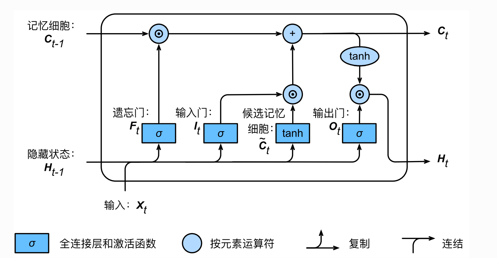

# README for Music Generaion by LSTM
## 总述
- 使用LSTM生成音乐
- 给一段音乐的开头作为context/condition，通过step by step的方式，生成指定长度的音乐片段

## 技术框架
- 基于Python
- 选择PyTorch作为Deep Learning的框架
- ffmpeg和scipy进行音频处理
- numpy进行傅里叶变换

## 执行
### 训练音乐生成网络
```bash
python main.py --audio_dir <audio_dir>
```
### 推理阶段生成音乐
```bash
python inference.py --checkpoint_path <checkpoint_path> --audio_dir <audio_dir>
```
### 其他
- 执行`python main.py -h`查看训练阶段的各种设置
- 执行`python inference.py -h`查看推理阶段的各种设置

## 原理简述
### 音频预处理
- 对音频进行降采样，降低训练开销，在音频质量和训练开销之间进行折中
- 以音频采样率为时间窗，对音频进行傅里叶变换，得到频域分量，作为网络的输入特征量
### 网络构造
- 使用LSTM作为predictor
  - 
  - 相比于RNN引入了多个门控单元，更好捕捉长期记忆
  - 缓解了梯度衰减和梯度爆炸的问题
- 引入Dropout防止过拟合
### 训练
- 以输入的音频作为condition/context，进行接下来指定长度的音频的预测
- 使用MSE进行约束，作为损失函数
- 使用Adam优化器，迭代更新网络参数
### 推理
- 以输入的音频作为condition/context，进行接下来指定长度的音频的预测
- 使用step-by-step的预测方式进行迭代，直到生成的音频长度达到指定长度
### 转为可播放音频(.wav)
- 对网络的输出量进行傅里叶逆变换，得到可播放的音频

## 代码结构
- `dataset`
  - 数据结构，训练时依靠该迭代器取数据
- `model`
  - 网络结构
- `utils`
  - 实用工具，如音频处理代码
- `main.py`
  - 训练网络
- `inference.py`
  - 测试/推理